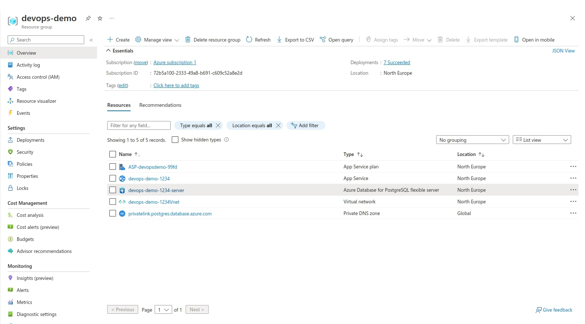
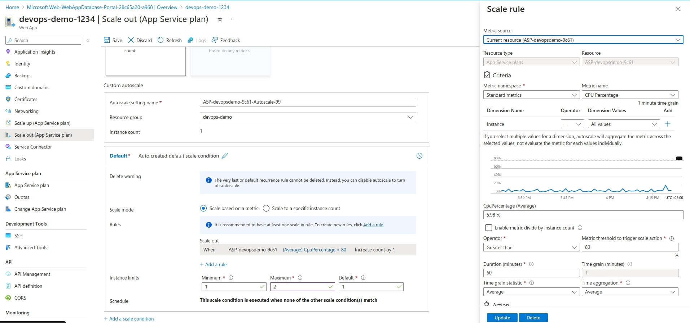
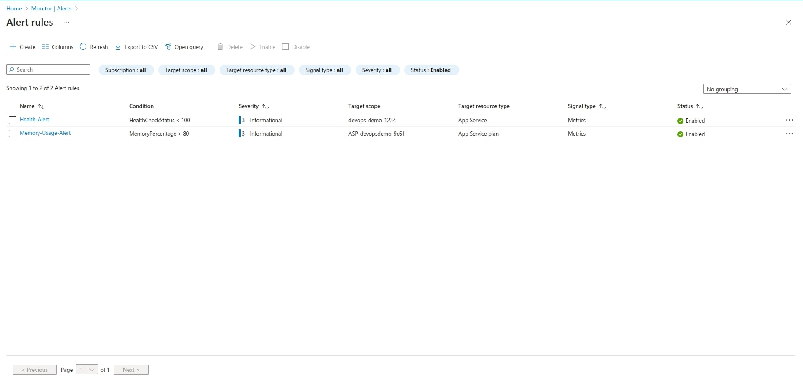
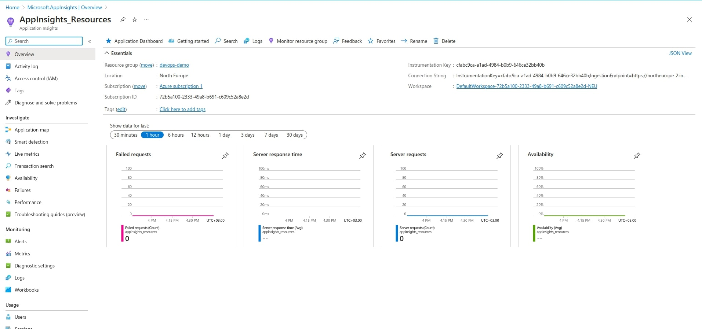

# devops-demo

The only porpose of this project is to demonstrate how a web application is deployed in cloud using Azure. The project contains a simple NodeJs app which serves a static html page. The app is deployed to Azure using github actions. The workflow file for deployment is `.github/workflows/deployment.yml`.

## Azure configuration

The Azure resource group that is running the application is a webapp resource which is connected to a database PostgreSQL resource:

I added an autoscale rule for the CPU percentage usage. When its usage is greater than 80%, the number of instances will increase from 1 to 2.

I created 2 alert rules: one for checking the health status of the resource group and one for checking the memory usage of the application.

I also enabled the Azure's AppInsights.

## Note

After reviewing my solution, please notify me so that I can delete the Azure's resources.